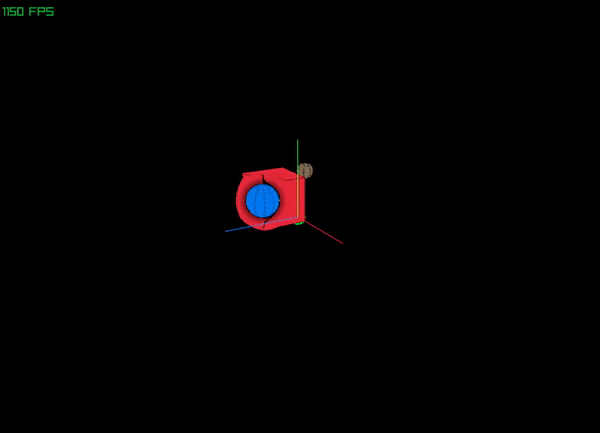
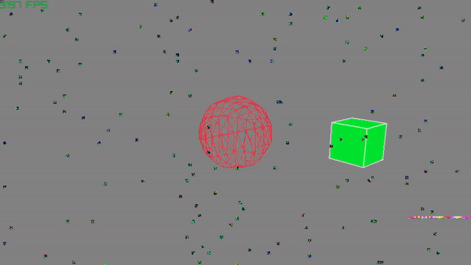
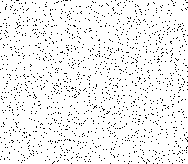
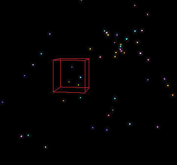
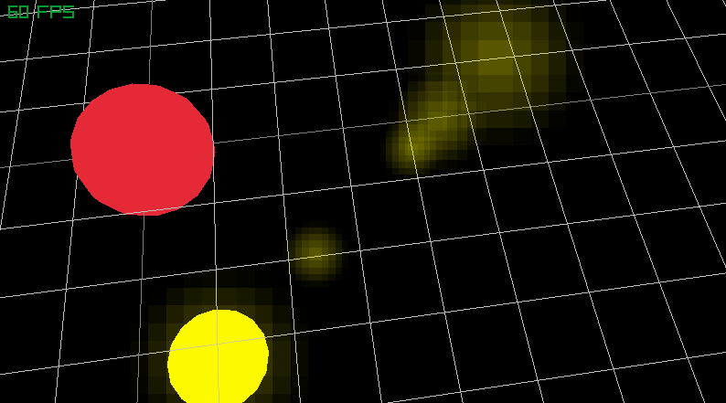
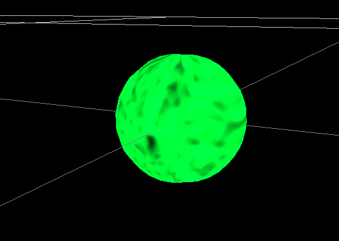
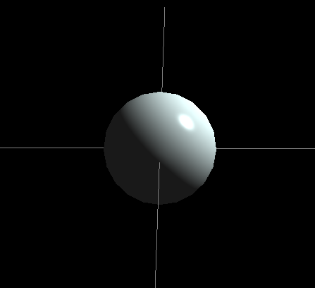

# Hephaestus's Shader Sandbox

Welcome to where I centralize all my shader work. 
If you'd like to learn how to make shaders like this yourself, 
head over to [raylib's example directory](https://github.com/raysan5/raylib/tree/master/examples/shaders) and [learnopengl.com](learnopengl.com).

Anything with `"Shaders"` in quotes is not a GPU shader, but just graphical trick done by CPU.

## Warp Shader

## Camera Glitch Shader (Dead Pixels + Radiation Bands)

## First Camera Glitch "Shader" (only Dead Pixels)

## Stars By Instancing on GPU + Bloom Shader

## Lens Flare "Shader"

## Procedural Texture on Star Shader

## Basic (Phong) Lighting

